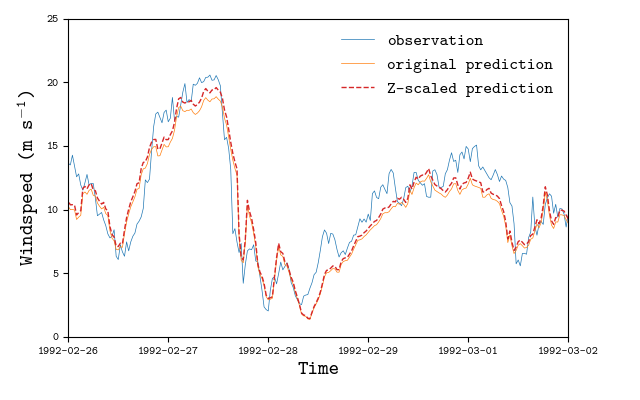
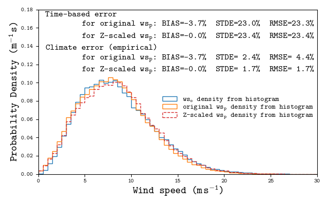
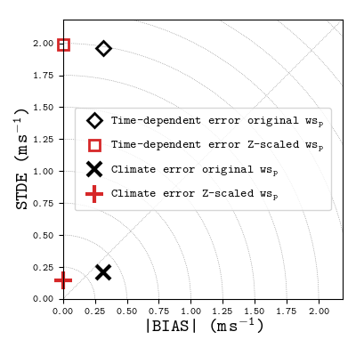

[](https://github.com/calvr/climate-error/actions/workflows/ci.yml)
[](https://github.com/calvr/climate-error/actions/workflows/release-testpypi.yml)
[](https://github.com/calvr/climate-error/actions/workflows/release.yml)  
[](https://pypi.org/project/climate-error/)
[](https://pypi.org/project/climate-error/)
[](https://github.com/calvr/climate-error/blob/main/LICENSE)


# `climate-error`: Quantile Error Metrics for Wind Climates 

Error Metrics for Wind Climates based on Statistical Quantiles and Wasserstein Distances.


## Description

Climate error metrics quantify the agreement between wind speed climates
by comparing the statistical distributions of predictions and observations.

For two time series of predictions $$x_p(t)$$ and observations $$x_o(t)$$, conventional **time-dependent error metrics** are defined from the difference of paired time records:  

$$\epsilon_n = x_p(t_n) - x_o(t_n), \quad n = 1, \ldots, N,$$  

where $t_n$ is a time index and $\epsilon$ is the error from which metrics such as the BIAS, the *root of the mean squared errors* (RMSE) and the *standard deviation of the error* (STDE) are computed:  

$$\text{BIAS} = \mathbb{E}[\bf{\epsilon}], \qquad
\text{RMSE} = \sqrt{\mathbb{E}[\bf{\epsilon}^2]}, \qquad
\text{STDE}^2 = \text{RMSE}^2 - \text{BIAS}^2.$$  

While BIAS is independent of time alignment, RMSE and STDE are affected by **time‑lag (phase) errors**, which can dominate these metrics even when predictions and observations share the same climate statistics.

The `climate-error` module enables the computation of **time-independent error metrics**
by comparing the probability distributions that govern the datasets.
This is achieved by computing the differences between the quantiles of the predicted and observed wind‑speed distributions,
given by the quantile functions $Q_p(u)$ and $Q_o(u)$, respectively.
The quantile-based metrics provided by `climate-error` are defined as:  

$$\text{BIAS} = \int_0^1 \left( Q_p(u) - Q_o(u) \right) du
\equiv \mathbb{E}[\mathbf{p}] - \mathbb{E}[\mathbf{o}],$$  

$$\text{RMSE}^2 \approx \int_0^1 \left[ Q_p(u) - Q_o(u) \right]^2 du,$$  

$$\text{STDE}^2 = \text{RMSE}^2 - \text{BIAS}^2.$$  

These expressions correspond to signed first-order and second-order **Wasserstein distances** between distributions, yielding error metrics that:  
- are independent of time alignment,
- separate systematic (accuracy) and random (precision) error,
- retain the physical units of wind speed,
- are directly comparable to conventional BIAS, RMSE, and STDE.

A related measure is the *area metric* of [Ferson et al. (2008)].
Yet, its value cannot be split into systematic and random error
as its formulation is an absolute first-order Wasserstein distance (also known as the [earth mover's distance](https://en.wikipedia.org/wiki/Earth_mover%27s_distance)).

These metrics are applicable to empirical distributions derived from samples, analytical distributions (e.g. Weibull), and comparisons between analytical and empirical distributions (e.g. goodness-of-fit).

For further details on the mathematical formulation and the statistical arguments favoring their application,
please refer to [Veiga Rodrigues & Odderskov (2025)].


## What's in this repository

- Code: reference implementation of the `climate-error` metrics (BSD 3‑Clause).
- Tests: software test suite in [`tests/`](./tests/) (BSD 3‑Clause).
- Data (derived): small, curated subsets produced from publicly available sources
  (DTU Data datasets and the NEWA API), stored under [`example_wind_data/`](./example_wind_data/)
  or generated by scripts in that folder. For **Attribution & licensing** please refer to
  [`ATTRIBUTION.md`](./ATTRIBUTION.md) for per-source details.
  Datasets: see [La Ventosa dataset (2021)] and [Capel-Cynon dataset (2021)]; NEWA API details: [NEWA Application].
- Examples: python scripts and results in [`examples/`](./examples/) (BSD 3‑Clause) with application of the `climate-error` metrics focusing the datasets in [`example_wind_data/`](./example_wind_data/).


## Other methods provided in the source code

The methods used to fit Weibull distributions to a data sample are
described in [EWA (1989)] and [EMD (2014)]. Other implementations
of this method may be found in [Climatic] and [ANEMOI] software repositories.


## License

This project is released under the **BSD 3‑Clause License**.
See the `LICENSE` file for details.


## Citation

If you use this repository or the underlying methodology, please cite:

Veiga Rodrigues C & Odderskov I (2025).
**Climate error metrics based on Wasserstein distances.**
*Applied Energy*, Volume 398, 126392. [DOI: 10.1016/j.apenergy.2025.126392][ClimErr DOI]

Also consider citing this repository (see [`CITATION.cff`](./CITATION.cff)).


## How to use the `climate-error` metrics

### Walkthrough

After installation, the metrics can be used by importing the appropriate module:
```python
>>> import climate_error as climerr
>>> climerr.__all__
['__version__', '__citation__', 'get_concurrent_records', 'estimate_bins', 'weibull_moment', 'weibull_cdf', 'weibull_ppf', 'weibull_pdf', 'ewa_weibull_fit_sample', 'ewa_weibull_fit_hist', 'numerical_wasserstein', 'error_metrics_wasserstein_weibull', 'error_metrics_wasserstein_2sample', 'error_metrics_wasserstein_weibull_vs_sample', 'error_metrics_timeseries', 'normalise_error_metrics']
```

Consider two time series with observations and predictions:
```python
>>> import numpy as np

>>> N = 365*24*6

>>> Ao, Ko = 6., 1.8
>>> wso = np.random.weibull(Ko, N) * Ao  # observations

>>> Ap, Kp = 8., 2.5
>>> wsp = np.random.weibull(Kp, N) * Ap  # predictions
```
where for demonstration purposes these were taken from random samples of Weibull distributions.
As the samples should be completely uncorrelated, index-based errors are expected to be high:
```python
>>> t_bias, t_stde, t_rmse = climerr.error_metrics_timeseries(wsp, wso)
>>> t_bias_n, t_stde_n, t_rmse_n = climerr.normalise_error_metrics(t_bias, t_stde, t_rmse, wso.mean())

>>> print(f"Time dependent error (m/s): {t_bias=:.1f}  {t_stde=:.1f}  {t_rmse=:.1f}")
Time dependent error (m/s): t_bias=1.8  t_stde=4.3  t_rmse=4.7

>>> print(f"Time dependent error (%): {t_bias_n=:.0f}%  {t_stde_n=:.0f}%  {t_rmse_n=:.0f}%")
Time dependent error (%): t_bias_n=34%  t_stde_n=81%  t_rmse_n=88%
```
where in this context STDE is the biased standard deviation of the error and whose definition matches
$STDE^2 = RMSE^2 - BIAS^2$.

The error between the two Weibull distributions can be computed analytically
via the `error_metrics_wasserstein_weibull` method:
```python
>>> w_wso_mu = climerr.weibull_moment(Ao, Ko, n=1)
>>> print(f"Weibull dist. observations mean = {w_wso_mu:.2f} m/s")
Weibull dist. observations mean = 5.34 m/s

>>> w_bias, w_stde, w_rmse = climerr.error_metrics_wasserstein_weibull(Ap, Kp, Ao, Ko)
>>> w_bias_n, w_stde_n, w_rmse_n = climerr.normalise_error_metrics(w_bias, w_stde, w_rmse, w_wso_mu)
>>> print(f"Weibull dist. error (m/s): {w_bias=:.1f}  {w_stde=:.1f}  {w_rmse=:.1f}")
Weibull dist. error (m/s): w_bias=1.8  w_stde=0.3  w_rmse=1.8

>>> print(f"Weibull dist. error (%): {w_bias_n=:.0f}%  {w_stde_n=:.0f}%  {w_rmse_n=:.0f}%")
Weibull dist. error (%): w_bias_n=33%  w_stde_n=6%  w_rmse_n=34%
```
Whereas the index-based errors were showing high STDE, the error metrics
focused on the agreement between the Weibull distributions have much less STDE,
thus RMSE is mainly due to the BIAS.

The climate-error metrics are applicable to samples, where for each dataset
the respective empirical distribution is estimated and their agreement
is computed through Wasserstein distances,
following the framework in [Veiga Rodrigues & Odderskov (2025)].
This is achieved by `error_metrics_wasserstein_2sample`:
```python
>>> q_bias, q_stde, q_rmse = climerr.error_metrics_wasserstein_2sample(wsp, wso)
>>> q_bias_n, q_stde_n, q_rmse_n = climerr.normalise_error_metrics(q_bias, q_stde, q_rmse, wso.mean())
>>> print(f"Empirical dist. error (m/s): {q_bias=:.1f}  {q_stde=:.1f}  {q_rmse=:.1f}")
Empirical dist. error (m/s): q_bias=1.8  q_stde=0.3  q_rmse=1.8

>>> print(f"Empirical dist. error (%): {q_bias_n=:.0f}%  {q_stde_n=:.0f}%  {q_rmse_n=:.0f}%")
Empirical dist. error (%): q_bias_n=34%  q_stde_n=6%  q_rmse_n=34%
```
where the values are fully inline with the analytical error associated with the Weibull distributions.

Finally, a sample can also be compared against an analytical Weibull distribution
through `error_metrics_wasserstein_weibull_vs_sample`. For a Weibull distribution
whose parameters were fitted to a data sample, this method may be used to infer
the goodness-of-fit:
```python
>>> climerr.error_metrics_wasserstein_weibull_vs_sample(Ao, Ko, wso)

>>> Afit, Kfit = climerr.ewa_weibull_fit_sample(wso)
>>> print(f"{Afit=:.2f} m/s,  {Kfit=:.3f}")
Afit=5.98 m/s,  Kfit=1.795

>>> g_bias, g_stde, g_rmse = climerr.error_metrics_wasserstein_weibull_vs_sample(Afit, Kfit, wso)
>>> g_bias_n, g_stde_n, g_rmse_n = climerr.normalise_error_metrics(g_bias, g_stde, g_rmse, wso.mean())
>>> print(f"Weibull goodness-of-fit (m/s): {g_bias=:.2f}  {g_stde=:.2f}  {g_rmse=:.2f}")
Weibull goodness-of-fit (m/s): g_bias=0.00  g_stde=0.03  g_rmse=0.03

>>> print(f"Weibull goodness-of-fit (%): {g_bias_n=:.0f}%  {g_stde_n=:.0f}%  {g_rmse_n=:.0f}%")
Weibull goodness-of-fit (%): g_bias_n=0%  g_stde_n=1%  g_rmse_n=1%
```
where the fitting method in `ewa_weibull_fit_sample` follows the European Wind Atlas approach [EWA (1989)].


### Examples

Four examples are provided in the [`examples/`](./examples/) where
one demonstrates the concept behind the use of `climate-error` metrics:  
- [`examples/run_periodic_lag_error.py`](./examples/run_periodic_lag_error.py),

and three other show applications of the `climate-error` metrics to the wind data in
[`example_wind_data/`](./example_wind_data/):  
- [`examples/run_experiment_realcase.py`](./examples/run_experiment_realcase.py),  
- [`examples/run_experiment_timelags.py`](./examples/run_experiment_timelags.py),  
- [`examples/run_experiment_weibullFitError.py`](./examples/run_experiment_weibullFitError.py).  

To run any of the examples, the [`run_docker.sh`](./run_docker.sh) bash script can be executed
to initiate an interactive docker container that will be destroyed after exiting it. The
code executed while initializing the container install the code and ensures software tests
are run. This allows to quickly test `climate-error` and its application examples. 

In case there are issues with attaining a graphical environment,
the [`run_docker.sh`](../run_docker_wsl.sh) bash script can be executed instead
and figures will be saved as PNG files, together with results TXT tables.
Instruction on how to copy figures and other files to the host system
are available in the [examples documentation](./examples/README.md).

Taking the [`run_experiment_realcase.py`](./examples/run_experiment_realcase.py) example:
```bash
~/climate-error $ ./run_docker.sh 
non-network local connections being added to access control list
channels:
  - conda-forge
...
===================== test session starts ==================
...
================= 7 passed, 8 warnings in 2.95s ============ 

(base) root@ceebc070f35f:/opt/repo#
```
after the interactive shell is ready, the code in the examples can be run:
```
(base) root@ceebc070f35f:/opt/repo#  python examples/run_experiment_realcase.py
REPO_DIR=PosixPath('/opt/repo/examples')
DATA_DIR=PosixPath('/opt/repo/example_wind_data')
Sampling interval determined from TimeStamps as 30.0 min
Sampling interval determined from TimeStamps as 30.0 min
Sampling interval determined from TimeStamps as 30.0 min
Sampling interval determined from TimeStamps as 30.0 min
Sampling interval determined from TimeStamps as 30.0 min
Sampling interval determined from TimeStamps as 30.0 min
Sampling interval determined from TimeStamps as 30.0 min
Sampling interval determined from TimeStamps as 30.0 min
Sampling interval determined from TimeStamps as 30.0 min
        Time-dependent error  Climate error (empirical)  Time-dependent error for Z-scaled TS  Climate error for Z-scaled TS (empirical)
BIAS     -0.31 m/s   (-3.7%)        -0.31 m/s   (-3.7%)                   -0.00 m/s   (-0.0%)                        -0.00 m/s   (-0.0%)
STDE      1.96 m/s   (23.0%)         0.21 m/s   ( 2.4%)                    1.99 m/s   (23.4%)                         0.15 m/s   ( 1.7%)
RMSE      1.98 m/s   (23.3%)         0.37 m/s   ( 4.4%)                    1.99 m/s   (23.4%)                         0.15 m/s   ( 1.7%)
 MAE      1.50 m/s   (17.6%)                        nan                    1.50 m/s   (17.5%)                                        nan
Area                     nan         0.31 m/s   ( 3.7%)                                   nan                         0.12 m/s   ( 1.4%)
```
and the following plots should be produced:






## References
<!-- Section anchor to link to this block as a whole -->
<a id="references"></a>

1. <a id="ref-climerr"></a> Veiga Rodrigues C, Odderskov I (2025). Climate error metrics based on Wasserstein distances. *Appli Energ*, 398:126392. [DOI: 10.1016/j.apenergy.2025.126392][ClimErr DOI]
2. <a id="ref-ventosa"></a> Hansen KS, Vasiljevic N, Sørensen SA (2021). *Resource data from the La Ventosa mast*. DTU Data. [doi:10.11583/DTU.14135609][Ventosa DOI]
3. <a id="ref-capel"></a> Hansen KS, Vasiljevic N, Sørensen SA (2021). *Resource data from the Capel Cynon masts*. DTU Data. [doi:10.11583/DTU.14135627][Capel DOI]
4. <a id="ref-newa"></a> New European Wind Atlas (NEWA) — About/Terms & data access. [Link][NEWA About].
5. <a id="ref-ewa89"></a> Troen I, & Lundtang Petersen E (1989). European Wind Atlas. Risø National Laboratory. [DTU Orbit URL][EWA89 URL]
6. <a id="ref-emd-weibull"></a> EMD International A/S (2014). *Fitting Weibull Parameters for Wind Energy Applications*. [PDF Document URL](https://help.emd.dk/mediawiki/images/a/a0/Description_of_Weibull_fitting.pdf).
7. <a id="ref-climatic"></a> *Climatic: Wind Data Visualization* (GitHub). [GitHub repository](https://github.com/wrobstory/climatic), file [climatic/weibull_est.py](https://github.com/wrobstory/climatic/blob/5f0be338f8560987ace64bb94c2713d89d2c4e75/climatic/weibull_est.py)
8. <a id="ref-anemoi"></a> *ANEMOI — EDF's pre‑alpha Python package for wind data analysis*. [GitHub repository](https://github.com/coryjog/anemoi), file [analysis/weibull.py](https://github.com/coryjog/anemoi/blob/6f1ad9711749e3759e02c5a5273610768fdcd593/anemoi/analysis/weibull.py)
9. <a id="ref-ferson"></a> Ferson S, Oberkampf WL, Ginzburg L (2008). Model validation and predictive capability for the thermal challenge problem. *Comput Methods Appl Mech Eng*, 197:2408-30. [DOI: 10.1016/j.cma.2007.07.030][AreaMetric DOI]

<!-- Reusable in-text shortcuts to the items above -->
[Veiga Rodrigues & Odderskov (2025)]: #ref-climerr
[La Ventosa dataset (2021)]: #ref-ventosa
[Capel-Cynon dataset (2021)]: #ref-capel
[NEWA Application]: #ref-newa
[EWA (1989)]: #ref-ewa89
[EMD (2014)]: #ref-emd-weibull
[Climatic]: #ref-climatic
[ANEMOI]: #ref-anemoi
[Ferson et al. (2008)]: #ref-ferson

<!-- Direct external links (DOIs / sites) -->
[ClimErr DOI]: https://doi.org/10.1016/j.apenergy.2025.126392
[Ventosa DOI]: https://doi.org/10.11583/DTU.14135609
[Capel DOI]: https://doi.org/10.11583/DTU.14135627
[NEWA About]: https://map.neweuropeanwindatlas.eu/about
[EWA89 URL]: https://orbit.dtu.dk/en/publications/european-wind-atlas/
[AreaMetric DOI]: https://doi.org/10.1016/j.cma.2007.07.030

