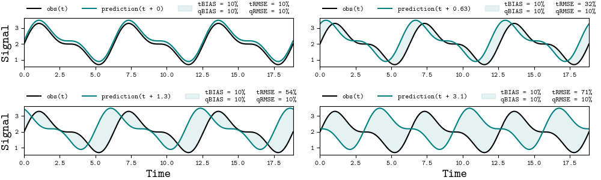
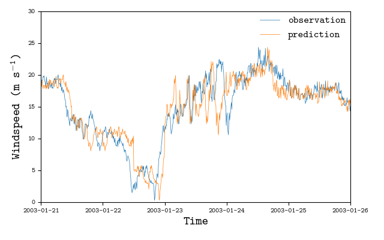
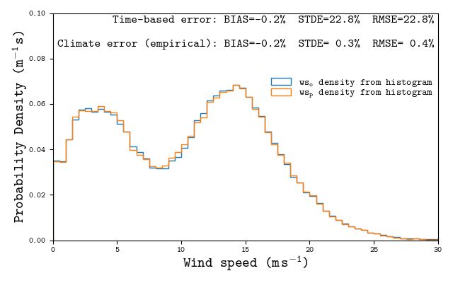
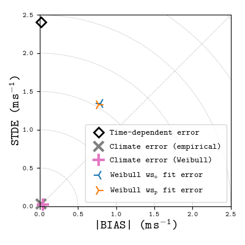
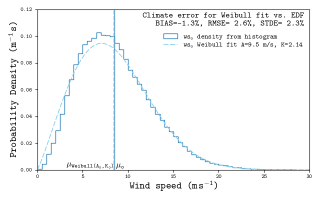

# Application examples of the `climate-error` metrics

Four examples are provided in the [`examples/`](./) where
one demonstrates the concept behind the use of `climate-error` metrics:  
- [`run_periodic_lag_error.py`](./run_periodic_lag_error.py),  
and three other show applications of the `climate-error` metrics to the wind data in
[`example_wind_data/`](../example_wind_data/):  
- [`run_experiment_realcase.py`](./run_experiment_realcase.py),  
- [`run_experiment_timelags.py`](./run_experiment_timelags.py),  
- [`run_experiment_weibullFitError.py`](./run_experiment_weibullFitError.py).

All of these examples are actual cases that can be found in:

[Veiga Rodrigues C & Odderskov I (2025)](../README#ref-climerr).
**Climate error metrics based on Wasserstein distances.**
*Applied Energy*, Volume 398, 126392. [DOI: 10.1016/j.apenergy.2025.126392][ClimErr DOI]

The wind measurements used in these examples are
from the [La Ventosa](#ref-ventosa) and [Capel-Cynon](#ref-capel)
datasets.
The weather predictions focusing the site were attained via the [NEWA Application](#ref-newa).


## Preparing the environment to run the examples

To run any of the examples, the [`run_docker.sh`](./run_docker.sh) bash script can be executed
to initiate an interactive docker container that will be destroyed after exiting it. The
code executed while initializing the container install the code and ensures software tests
are run. This allows to quickly test `climate-error` and its application examples.


Taking the [`run_experiment_realcase.py`](./examples/run_experiment_realcase.py) example:
```bash
~/climate-error $ ./run_docker.sh 
non-network local connections being added to access control list
channels:
  - conda-forge
...
===================== test session starts ==================
...
================= 7 passed, 8 warnings in 2.95s ============ 

(base) root@ceebc070f35f:/opt/repo#
```
after the interactive shell is ready, the code in the examples can be run:
```
(base) root@ceebc070f35f:/opt/repo#  python examples/run_experiment_realcase.py
...
```

## Example `run_periodic_lag_error.py`

This example focus two periodic signals, $o(t)$ and $p(t)$ that have a systematic error, where:  
$$o(t) = \sin(t) + 0.5 \sin(2t) + 2,$$  
$$p(t) = o(t + \tau) + 0.2,$$  
where $\tau$ is a time lag.

When $\tau$ is zero the signals are synchronized and the error for $p - o$ should:
- have a BIAS value that is the systematic error between the two signals;
- have a RMSE value that matches that of the BIAS;
- the standard deviation of the error (STDE) should be zero;
- values for time-dependent errors should match quantile-based errors (i.e. given by Wasserstein distances).

However, if $\tau$ is non-zero such that the two signals are not synchronized, then:  
- an STDE value exists, quantifying the phase error between the two signals;  
- the RMSE must be higher than BIAS magnitude;  
- values for time-dependent errors should increase when compared against $\tau=0$ error values;  
- values for quantile-based errors should match the $\tau=0$ error values.  

The goal of this example is to display all of these consequences stemming from the phase error between two similar signals.

After the interactive shell is ready, the example can be executed leading to the following output:
```bash
(base) root@ceebc070f35f:/opt/repo#  python examples/run_experiment_realcase.py
REPO_DIR=PosixPath('/opt/repo/examples')
DATA_DIR=PosixPath('/opt/repo/example_wind_data')
lag = 0.000 s
Time-based error:     	t_bias_n=10% 	t_stde_n=0% 	t_rmse_n=10%
Quantile-based error: 	q_bias_n=10% 	q_stde_n=0% 	q_rmse_n=10%

lag = 0.628 s
Time-based error:     	t_bias_n=10% 	t_stde_n=30% 	t_rmse_n=32%
Quantile-based error: 	q_bias_n=10% 	q_stde_n=0% 	q_rmse_n=10%

lag = 1.257 s
Time-based error:     	t_bias_n=10% 	t_stde_n=53% 	t_rmse_n=54%
Quantile-based error: 	q_bias_n=10% 	q_stde_n=0% 	q_rmse_n=10%

lag = 3.142 s
Time-based error:     	t_bias_n=10% 	t_stde_n=71% 	t_rmse_n=71%
Quantile-based error: 	q_bias_n=10% 	q_stde_n=0% 	q_rmse_n=10%
```

The following plot should be produced:




## Example `run_experiment_realcase.py`

This example focus the comparison between wind-speed time series of weather predictions and field measurements.
The dataset consists of measurements attained at the [Capel-Cynon site](#ref-capel).
The predictions were computed with the [NEWA Application](#ref-newa) workflow
whose results characterize the flow mesoscales. The goal is to use quantile-based error metrics
(a.k.a. climate-error metrics) to establish what is the error between the empirical wind distributions.

Briefly, the use of climate-error metrics is preferred as:

- Time-dependent RMSE and STDE is influenced by phase error (i.e. time lags)
  that is irrelevant if the goal is to predict the climate (i.e. the wind distribution).
  This is the intent of most siting and wind-resource assessment activities.
- Climate-error metrics yield values that are relatable to the time-dependent errors,
  as both characterizes wind-speed differences.

For more context please refer to [Veiga Rodrigues C & Odderskov I (2025)](#ref-climerr)
for further details and arguments on this topic.

After the interactive shell is ready, the example can be executed leading to the following output:
```bash
(base) root@ceebc070f35f:/opt/repo#  python examples/run_experiment_realcase.py
REPO_DIR=PosixPath('/opt/repo/examples')
DATA_DIR=PosixPath('/opt/repo/example_wind_data')
Sampling interval determined from TimeStamps as 30.0 min
Sampling interval determined from TimeStamps as 30.0 min
Sampling interval determined from TimeStamps as 30.0 min
Sampling interval determined from TimeStamps as 30.0 min
Sampling interval determined from TimeStamps as 30.0 min
Sampling interval determined from TimeStamps as 30.0 min
Sampling interval determined from TimeStamps as 30.0 min
Sampling interval determined from TimeStamps as 30.0 min
Sampling interval determined from TimeStamps as 30.0 min
        Time-dependent error  Climate error (empirical)  Time-dependent error for Z-scaled TS  Climate error for Z-scaled TS (empirical)
BIAS     -0.31 m/s   (-3.7%)        -0.31 m/s   (-3.7%)                   -0.00 m/s   (-0.0%)                        -0.00 m/s   (-0.0%)
STDE      1.96 m/s   (23.0%)         0.21 m/s   ( 2.4%)                    1.99 m/s   (23.4%)                         0.15 m/s   ( 1.7%)
RMSE      1.98 m/s   (23.3%)         0.37 m/s   ( 4.4%)                    1.99 m/s   (23.4%)                         0.15 m/s   ( 1.7%)
 MAE      1.50 m/s   (17.6%)                        nan                    1.50 m/s   (17.5%)                                        nan
Area                     nan         0.31 m/s   ( 3.7%)                                   nan                         0.12 m/s   ( 1.4%)
```

The following plots should be produced:


## Example `run_experiment_timelags.py`

Establishing which error metrics are best to infer climate error has the issue that
the best prediction would be the observations time series itself, leading to zero error. 
Time-independent error from a prediction that excludes the phase error (i.e. time lags),
but not other model errors, would require a world where *the perfect prediction had been produced*,
such that it could be used to validate our current prediction.
This is a *counterfactual unidentifiability* problem as the best hypothetical prediction
that would both have error but not time-lags is unobservable.

This example aims to ensure the climate-error metrics are indeed returning reasonable results.
Instead of focusing on the predictions from a weather model, the observations time series
is distorted into a new time series that:

- Contains time shifts whose lag period varies across the time series.
- Shares the same statistical characteristics as the original time series.

When applying time-dependent and climate error metrics, the latter should show
much lower random error than the former (inferred by the STDE value).
The results focus both the climate errors based on empirical and Weibull-based distributions.

To show the applicability of the climate-error metrics to
data the does not follow a Weibull distribution shape,
this example uses the [La Ventosa](#ref-ventosa) dataset which
is characterized by a bimodal distribution.

After the interactive shell is ready, the example can be executed leading to the following output:
```bash
(base) root@ceebc070f35f:/opt/repo#  python examples/run_experiment_timelags.py
REPO_DIR=PosixPath('/opt/repo/examples')
DATA_DIR=PosixPath('/opt/repo/example_wind_data')

## EXPERIMENT: WSp is copy of WSo with time lags

Sampling interval determined from TimeStamps as 10.0 min
Sampling interval determined from TimeStamps as 10.0 min
Sampling interval determined from TimeStamps as 10.0 min
Sampling interval determined from TimeStamps as 10.0 min
Sampling interval determined from TimeStamps as 10.0 min
Sampling interval determined from TimeStamps as 10.0 min
Sampling interval determined from TimeStamps as 10.0 min
        Time-dependent error    Climate error (empirical)    Climate error (Weibull)    Weibull wso fit error    Weibull wsp fit error
BIAS     -0.02 m/s   (-0.2%)          -0.02 m/s   (-0.2%)        -0.04 m/s   (-0.4%)       0.79 m/s   ( 7.5%)       0.77 m/s   ( 7.3%)
STDE      2.41 m/s   (22.8%)           0.03 m/s   ( 0.3%)         0.02 m/s   ( 0.2%)       1.34 m/s   (12.7%)       1.32 m/s   (12.6%)
RMSE      2.41 m/s   (22.8%)           0.04 m/s   ( 0.4%)         0.05 m/s   ( 0.4%)       1.56 m/s   (14.8%)       1.53 m/s   (14.6%)
 MAE      1.69 m/s   (16.1%)                          nan                        nan                      nan                      nan
Area                     nan           0.02 m/s   ( 0.2%)                        nan                      nan                      nan
```

The following plots should be produced:






## Example `run_experiment_weibullFitError.py`

The climate-error metrics may also be used to infer the goodness-of-fit of a Weibull distribution
whose parameters were adjusted to a wind dataset. This is achieved by computing error metrics to
get the agreement between the fitted Weibull against the empirical distribution.

After the interactive shell is ready, the example can be executed leading to the following output:
```bash
(base) root@ceebc070f35f:/opt/repo#  python examples/run_experiment_weibullFitError.py
REPO_DIR=PosixPath('/opt/repo/examples')
DATA_DIR=PosixPath('/opt/repo/example_wind_data')

## EXPERIMENT: Estimate Weibull fit error

        Weibull fit error through Wasserstein distances
BIAS                                -0.11 m/s   (-1.3%)
STDE                                 0.20 m/s   ( 2.3%)
RMSE                                 0.22 m/s   ( 2.6%)
```

The following plot should be produced:




## References
<!-- Section anchor to link to this block as a whole -->
<a id="references"></a>

1. <a id="ref-climerr"></a> Veiga Rodrigues C, Odderskov I (2025). Climate error metrics based on Wasserstein distances. *Applied Energy*, Volume 398, 126392. [DOI: 10.1016/j.apenergy.2025.126392][ClimErr DOI]
2. <a id="ref-ventosa"></a> Hansen KS, Vasiljevic N, Sørensen SA (2021). *Resource data from the La Ventosa mast*. DTU Data. [doi:10.11583/DTU.14135609][Ventosa DOI]
3. <a id="ref-capel"></a> Hansen KS, Vasiljevic N, Sørensen SA (2021). *Resource data from the Capel Cynon masts*. DTU Data. [doi:10.11583/DTU.14135627][Capel DOI]
4. <a id="ref-newa"></a> New European Wind Atlas (NEWA) — About/Terms & data access. [Link][NEWA About].


<!-- Reusable in-text shortcuts to the items above -->
[Veiga Rodrigues & Odderskov (2025)]: #ref-climerr
[La Ventosa dataset (2021)]: #ref-ventosa
[Capel-Cynon dataset (2021)]: #ref-capel
[NEWA Application]: #ref-newa

<!-- Direct external links (DOIs / sites) -->
[ClimErr DOI]: https://doi.org/10.1016/j.apenergy.2025.126392
[Ventosa DOI]: https://doi.org/10.11583/DTU.14135609
[Capel DOI]: https://doi.org/10.11583/DTU.14135627
[NEWA About]: https://map.neweuropeanwindatlas.eu/about

